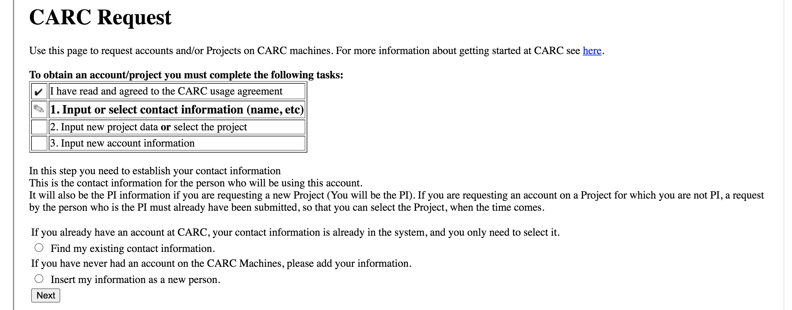
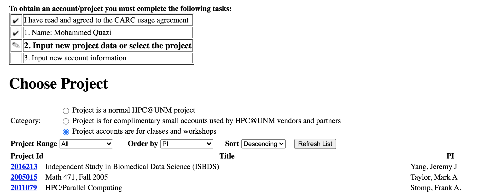
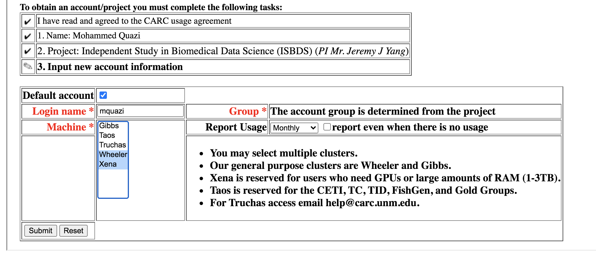
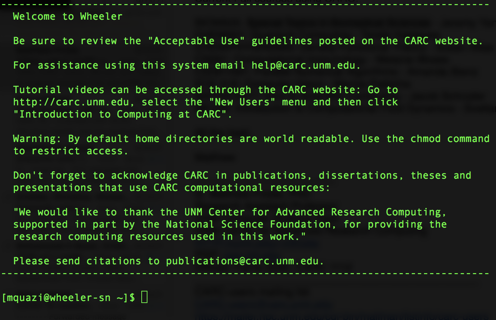
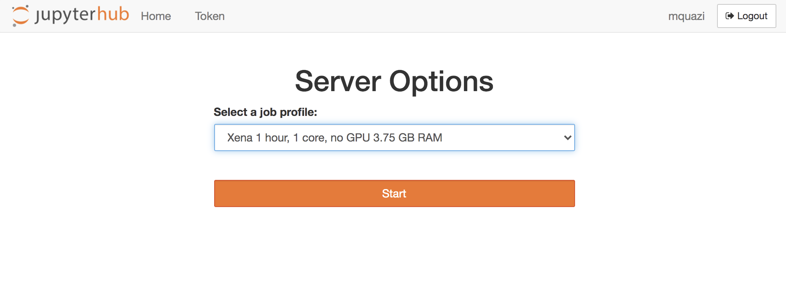
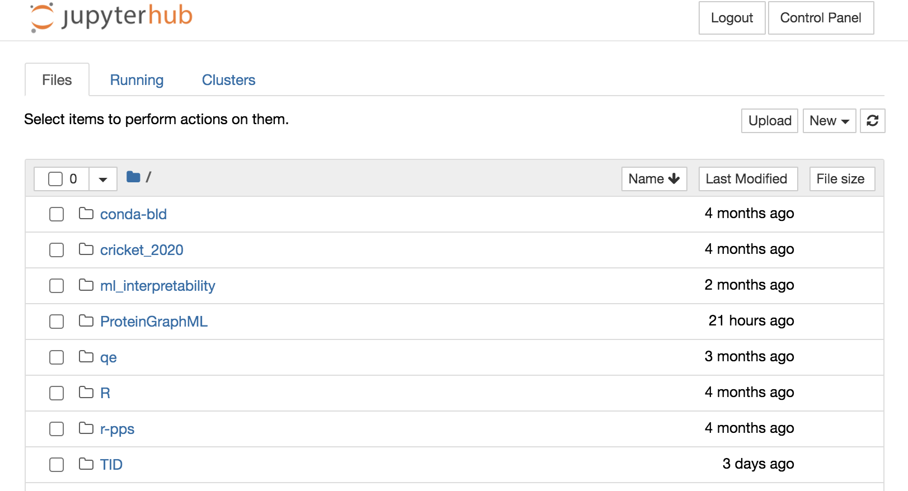
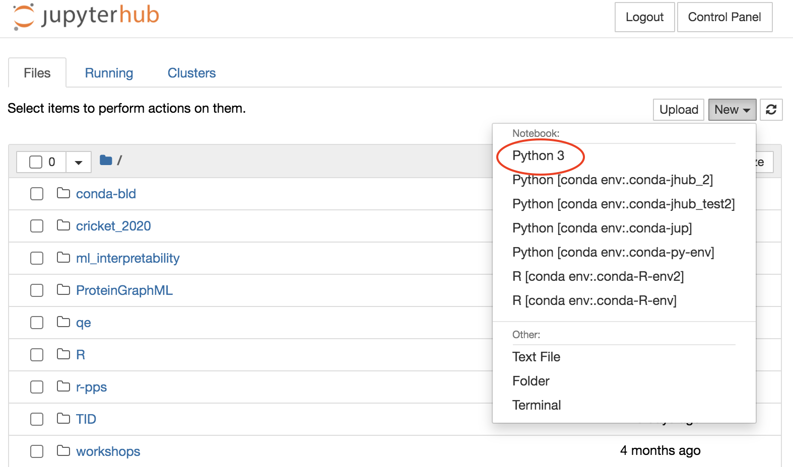
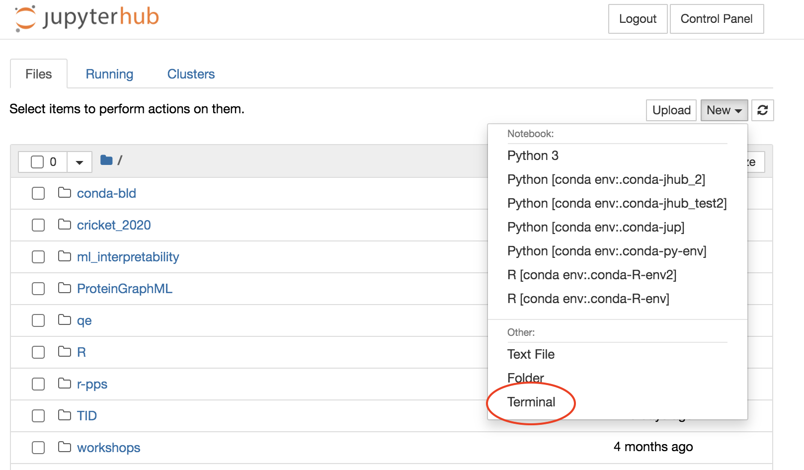

__Independent Study in Biomedical Data Science (ISBDS)__

# (I) How to setup your account for computations on Center for Advanced Research and Computing (CARC) at UNM? 

* Step 1: Go to [UNM CARC - Request and account](https://carc.unm.edu/new-users/request-an-account1.html) link and accept CARC User Agreement
* Step 2: If you have previously had an account on CARC, select the first option otherwise enter information as a new person and click Next 

  

* Step 3: Select following options as shown in image below
  * Category: Project accounts are for classes and workshops
  * Order by: PI 
  * Click Refresh List
  * Then click on Project ID 2016213 for Independent Study in Biomedical Data Science (ISBDS) course with Jeremy Yang as PI 

  

* Step 4: Select Wheeler and Xena clusters and hit Submit as shown below

  

* Step 5: Upon approval of your account, you will receive an email with instructions to obtain your passwords for both the clusters

# (II) After you have obtained your passwords for the two clusters

* Step 1: Open Terminal (command line) on your local machine (laptop/desktop)
* Step 2: Type the following command and hit enter 
```
ssh yourusername@wheeler.alliance.unm.edu
``` 
  Enter the password provided by the CARC admin. You shall see a welcome message. 
  
    
  
 * Step 3: Since this may be the first time you are logging in, you need to change your password to something different from CARC admin's password. Use following command to change your password
```
passwd
``` 
 * Step 4: Follow steps 2-3 on Xena cluster by replacing 'wheeler' with 'xena' in the `ssh` command in step 2

# (III) Some useful commands on Terminal on local machine 

Sl. No. | Commands | Actions
------------ | ------------- | ------------
1 | `ls`|  Get list of files 
2 | `qstat` | Check current users 
3 | `qgrok` | Check available/busy nodes 
4 | `mkdir foldername` | Create a new folder 
5 | `cd foldername` | Access a folder
6 | `cd ..` or `cd ~` | Go to home directory 
7 | `cd .` | Go back one step towards home directory
8 | `nano filename` | Open a file to edit 
9 | `Ctrl X` | Exit the editing environment 
10 | `exit` | Exit the ssh server  
11 | `Python` | Open python environment 
12 | `R` | Open R environment 
13 | `module avail` | List of available modules on the cluster
14 | `module list` | List of available modules for you to use 
15 | `history` | Access previously executed commands 
16 | `qsub -I` | Access a node interactively
17 | `qsub PBSscript.sh` | Run a PBS script

# (IV) How to access servers via JupyterHub? 

* Step 1: Go to [Xena Cluster JupyterHub](https://xena.alliance.unm.edu:8000/hub/login) link, enter your username and password and sign in 

   
  
  
* Step 2: Under New tab you can open a new Notebook in Python 3 environment

   
  
* Step 3: You can access the terminal from here as well as shown below

   
  
# (V) Some useful commands on Terminal on via JupyterHub 
  
Sl. No. | Commands | Actions
------------ | ------------- | ------------
1 | `ls`|  Get list of files 
2 | `qstat` | Check current users 
3 | `qgrok` | Check available/busy nodes 
4 | `mkdir foldername` | Create a new folder 
5 | `cd foldername` | Access a folder
6 | `cd ..` or `cd ~` | Go to home directory 
7 | `cd .` | Go back one step towards home directory
8 | `nano filename` | Open a file to edit 
9 | `Ctrl X` | Exit the editing environment 
10 | `exit` | Exit the ssh server  
11 | `Python` | Open python environment 
12 | `R` | Open R environment 
13 | `module avail` | List of available modules on the cluster
14 | `module list` | List of available modules for you to use 
15 | `history` | Access previously executed commands 
16 | `qsub -I` | Access a node interactively
17 | `qsub PBSscript.sh` | Run a PBS script


