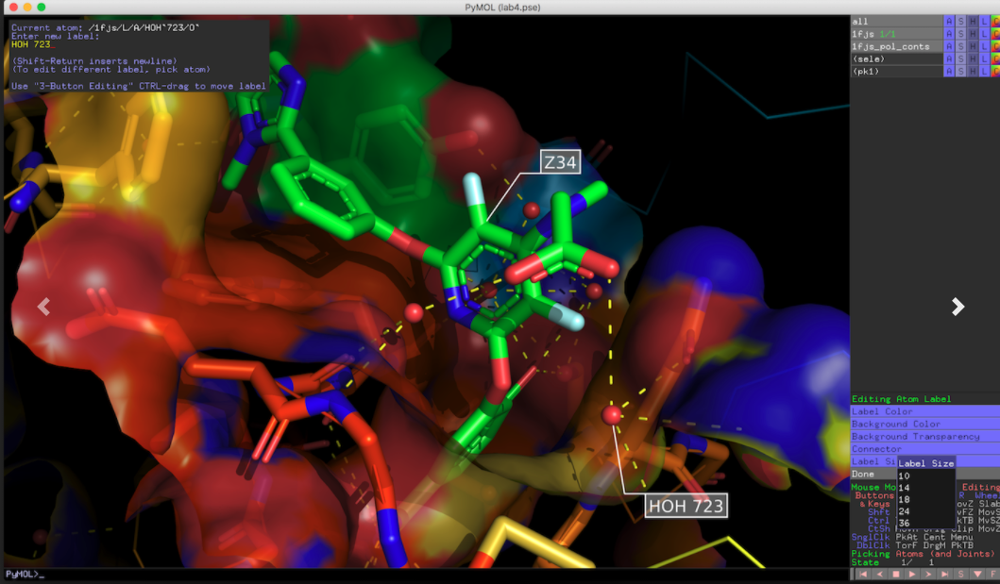

__Independent Study in Biomedical Data Science (ISBDS), UNM BIOMED 505__

# ISBDS Project Template: Homology Modeling

For 3D molecular modeling of proteins for which no experimental
structure exists, homology modeling provides an alternative by
leveraging the known structure of a protein with similar sequence.

This project involves 4OH-Tamoxifen, a widely prescribed breast
cancer drug, and known anti-estrogen, which binds Estrogen Receptor alpha
(ERalpha), a nuclear receptor (NR), and GPR30, a G-protein coupled receptor
(GPCR). Specialized software is used to dock the ligand into the
receptor site, and to visualize and model the protein-ligand
binding interactions.

* Datasource: [NCBI Gene database](https://www.ncbi.nlm.nih.gov/gene/)
* Datasource: [RCSB Protein Data Bank (PDB)](https://www.rcsb.org/)
* Datasource: [PubChem](https://pubchem.ncbi.nlm.nih.gov/)
* Datasource: [DrugCentral](https://drugcentral.org/)

Files available:

* Template Form: [DOCX](HomologyModeling.docx) [RTF](HomologyModeling.rtf)

Author (for questions): Jeremy Yang
