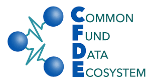

# `ISBDS: CFDE Edition` 

 * __ISBDS__: Independent Study in Biomedical Data Science
 * __CFDE__: Common Fund Data Ecosystem

The CFDE Edition of ISBDS is focused on effective use and integration
of NIH Common Fund datasets for biomedical discovery.

Students will have access to project templates, example code, documentation,
and other resources, based on CFDE scientific use cases, which can readily
be extended and customized for novel independent study projects.

The first session of __ISBDS: CFDE Edition__ is scheduled for the summer
of 2024, as a fully remote, online course. 

## Dates: 
 * June 3 - July 26, 2024

## Prerequisites and requirements:
 * Learners with a broad range of data science skills are welcome to participate via research plan designed to be suitable to their background.
 * Students are required to use their own computer. 

## Registration: 
 * [Registration Form](https://forms.gle/vi1BNB2Wd8Nd5bcm7)
 * Please save a copy of your confirmation email.
 * In mid-May, registered students will receive an introductory email, invitation to an orientation meeting (via videoconference), and instructions regarding research plan development.

## Contacts:
 * Jeremy Yang, Instructor <jjyang@salud.unm.edu>
 * Vincent Metzger, Lead Advisor <vtmetzger@salud.unm.edu>
 * Feel free to contact us with any questions about the course.

See also:

* [ISBDS Course Home Page](https://datascience.unm.edu/isbdscourse/)
* [CFDE NIH Home Page](https://commonfund.nih.gov/dataecosystem)
* [CFDE Consortium Home Page](https://nih-cfde.org/)
